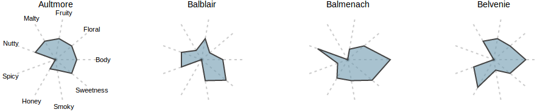
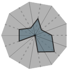

# d3-star-plot

`d3.starPlot()` is designed to be a
[reusable](http://bost.ocks.org/mike/chart/) chart generator with sane
defaults and the necessary customization options. It encourages familiar
d3 design patterns to make building a series of star plots simple.

    var star = d3.starPlot()
      .properties([
        'Body',
        'Sweetness',
        'Smokey'
      ])
      .scales(scale);
      .labels([
        'Body',
        'Sweetness',
        'Smokey'
      ])

    data.forEach(function(d) {
      d3.select(body).append('svg')
        .datum(d)
        .call(star)
    });

## Example

[Live demo on bl.ocks.org](http://bl.ocks.org/kevinschaul/8833989)

To run the included example locally:

    $ npm install
    $ grunt

Open [http://0.0.0.0:8000](http://0.0.0.0:8000) in your browser.

## Downloads

- [d3-star-plot-0.0.3.min.js](https://raw.github.com/kevinschaul/d3-star-plot/master/dist/d3-star-plot-0.0.3.min.js)

## API

d3.**starPlot**()

Constructs a new star plot. The returned function generates svg elements
to create a star plot, including axis lines, labels, an origin circle
and the star plot path according to the associated data.

    var star = d3.starPlot();

star.**properties**([properties])

If `properties` is specificed, sets the datum properties to use in the
specified star plot.  If `properties` is not specificed, returns the
current properties. These must be set for the returned star plot
generator to produce a worthwhile chart.

`properties` must be an array of String objects corresponding to
properties of the datum. The order of `properties` determines the
clockwise order of attributes to be drawn with the returned star plot
generator.

    star.properties([
      'Body',
      'Sweetness',
      'Smokey'
    ]);

star.**scales**([scales])

If `scales` is specificed, sets the scale functions for the
specified star plot.  If `scales` is not specificed, returns the
current scale functions. `scales` must be set for the returned star plot
generator to produce a worthwhile chart.

`scales` must be either a single [d3.scale](https://github.com/mbostock/d3/wiki/Scales) function or an array of
[d3.scale](https://github.com/mbostock/d3/wiki/Scales) functions for the star plot's associated data. It is used in
conjunction with `properties` to compute the shape of the resulting star
plot. Each scale in `scales` should give the `properties` data the range
`[0, 100]`. If a single scale is specified, it will be used for all
`properties`.  If an array of scales is specified, the order of `scales`
should match the order of `properties`.

    var scale = d3.scale.linear()
      .domain([0, 4])
      .range([0, 100])

    // This ...
    star.scales(scale);

    // ... is equivalent to this
    star.scales([
      scale,
      scale,
      scale
    ])

star.**labels**([labels])

If `labels` is specificed, sets the attriute labels for the
specified star plot.  If `labels` is not specificed, returns the
current labels. This value is optional.

`labels` can be either an array of strings or a function returning
strings in the order that the corresponding accessor functions are in.

    star.labels([
      'Body',
      'Sweetness',
      'Smokey'
    ]);

    star.labels(function(d, i) { return 'property ' + i; });

star.**labelMargin**([m])

If `m` is specificed, sets the margin of the specified star plot. If `m`
is not specificed, returns the current label margin value. This value is
used to place data labels farther from the origin. The default value is
`20`.

    star.labelMargin(20);

star.**width**([w])

If `w` is specificed, sets the width of the specified star plot. If `w`
is not specificed, returns the current width value. Because star plots
are square, the width value is also used for the height of the star
plot. The default value is `200`.

    star.width(200);

star.**margin**([m])

If `m` is specificed, sets the margin of the specified star plot. If `m`
is not specificed, returns the current margin value. `m` must be an
object with `top`, `right`, `bottom` and `left` properties.  By default,
these values are all `0`.

    var m = {
      top: 0,
      right: 0,
      bottom: 0,
      left: 0
    };
    star.margin(m);

star.**includeGuidelines**([boolean])

If `boolean` is specificed, sets the value. If `boolean`
is not specificed, returns the current label margin value. If this value
is true, the returned star plot generator will include lines from the
origin to the value of each of the data's attributes. The default value
is `true`.

    star.includeGuidelines(true);

star.**title**([title])

If `title` is specificed, sets the title accessor function of the
specified star plot. If `title` is not specificed, returns the current
title accessor function. The value returned by this function is used by
the returned star plot generator to label the chart.

    star.title(function(d) { return d.Distillery; });

star.**interaction**()

Returns an interaction generator to be used in conjunction with the star
plot generator. The returned function will build an overlay useful for
attaching interaction events to.

The image above shows the interaction overlay in gray. Each property is
separated by a solid line. These triangles are useful for attaching
mouse events to.

An event attached to a generation of `interaction` will include the
following properties:

  - **key**: The property associated with this event
  - **datum**: The datum associated with the star plot. This can be
    combined with `key` to find the datum value associated with this event.
  - **x**: The x coordinate of the value on the star plot
  - **y**: The y coordinate of the value on the star plot
  - **xExtent**: The x coordinate of the maximum possible value on the star plot
  - **yExtent**: The y coordinate of the maximum possible value on the star plot

Note: These coordinates consider 0,0 to be the top, left space in the
associated svg element.

    svg.append('g')
      .datum(d)
      .call(star)
      .call(star.interaction)

The example included locally and the [live
demo](http://bl.ocks.org/kevinschaul/8833989) both have a full example.

